# SQL-Lab1
- Create a table "BooksAuthors" containing two fields (AuthorId, BookId)
 Answer:
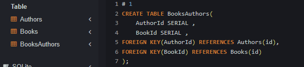
- Insert at least 5 records into the BooksAuthors table.
 Answer:
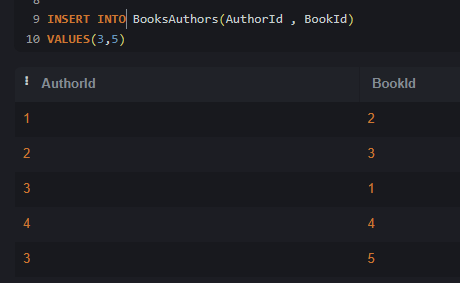
- Write a statement that will select the Country column from the Authors table.
 Answer:
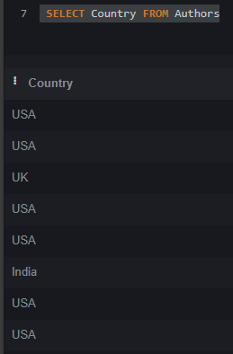
- Select all the different values from the Country column in the Authors table.
 Answer:
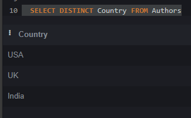
- Write an SQL query to return only Authors whose name begins with S.
 Answer:
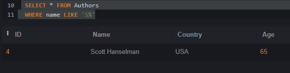
- List the number of Authors in each country.
 Answer:
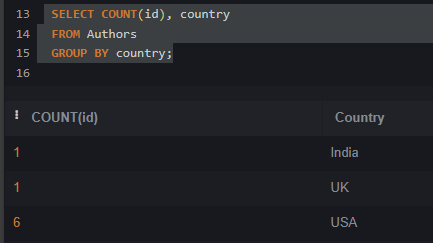
- Select all records from the Authors table, and sort the result alphabetically by the column's name.
 Answer:
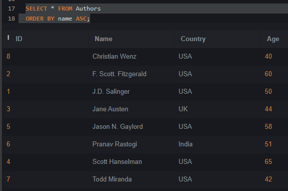
- Select all records from the Authors table, and sort the result reversed alphabetically by the column name.
 Answer:
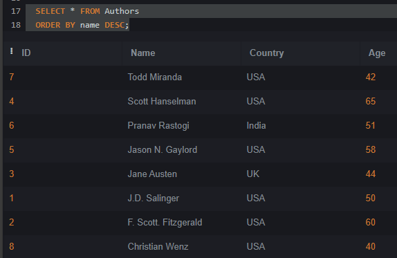
- Select all records where the Title column has the value ‘Great ' from the Books table.
 Answer:
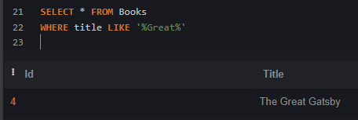
- Use the NOT keyword to select all records where the country is NOT "USA".
 Answer:
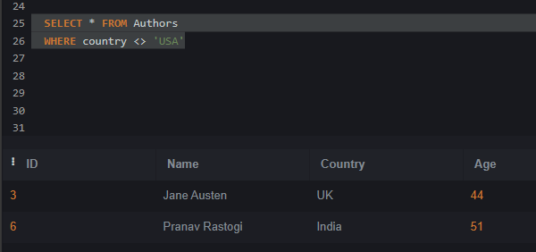
- Select all records where the country column has the value 'USA' or ‘India' from the “Authors” table
 Answer:
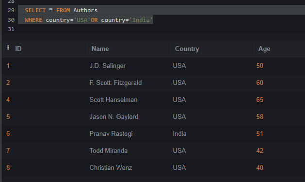
- Select all records where the age column has the value BETWEEN 50 - 60 in the “Authors” table.
 Answer:
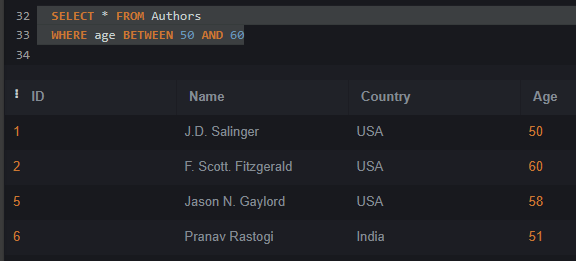
- Use the MIN function to select the record with the smallest value of the Age column from the “Authors” table.
 Answer:
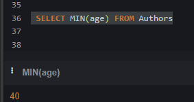
- Choose the correct `JOIN` clause to view all books and their authors.
 Answer:
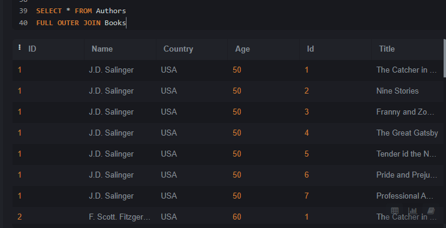
