# SQL-Lab1
## Saleh Bin Shaheen Answers :
- Create a table "BooksAuthors" containing two fields (AuthorId, BookId)
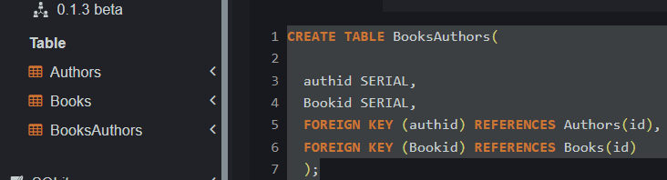

- Insert at least 5 records into the BooksAuthors table.

- Write a statement that will select the Country column from the Authors table.

- Select all the different values from the Country column in the Authors table.

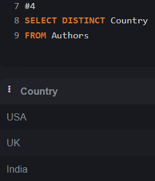

- Write an SQL query to return only Authors whose name begins with S.

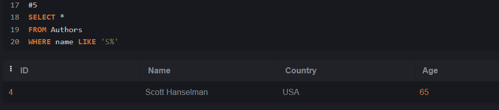

- List the number of Authors in each country.

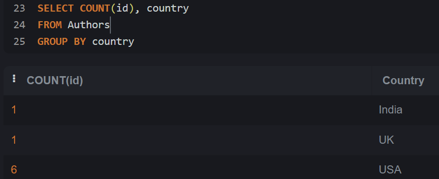

- Select all records from the Authors table, and sort the result alphabetically by the column's name.

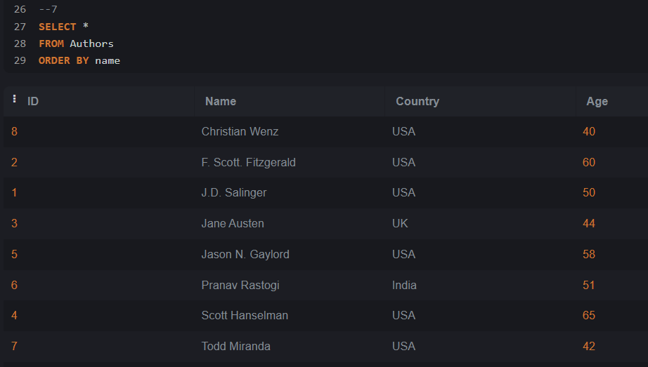

- Select all records from the Authors table, and sort the result reversed alphabetically by the column name.

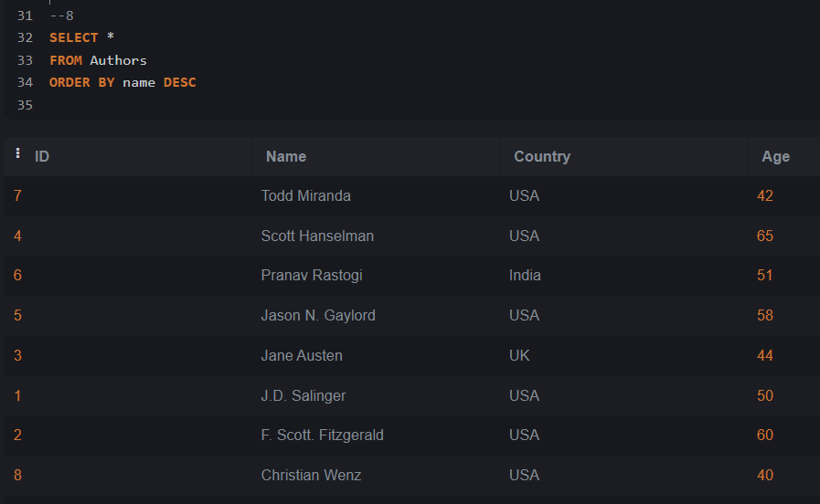

- Select all records where the Title column has the value ‘Great ' from the Books table.

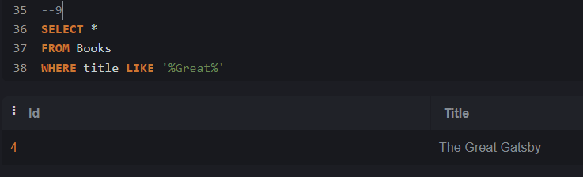

- Use the NOT keyword to select all records where the country is NOT "USA".

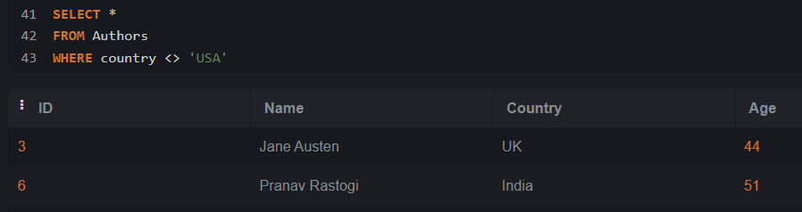

- Select all records where the country column has the value 'USA' or ‘India' from the “Authors” table

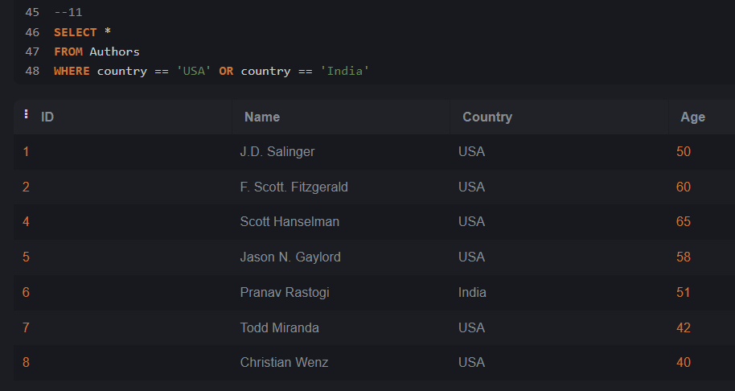

- Select all records where the age column has the value BETWEEN 50 - 60 in the “Authors” table.

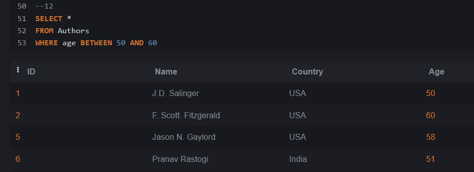

- Use the MIN function to select the record with the smallest value of the Age column from the “Authors” table.

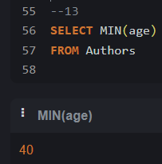

- Choose the correct `JOIN` clause to view all books and their authors.

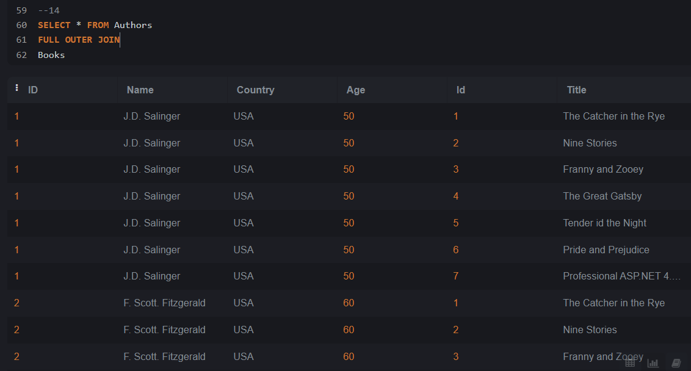